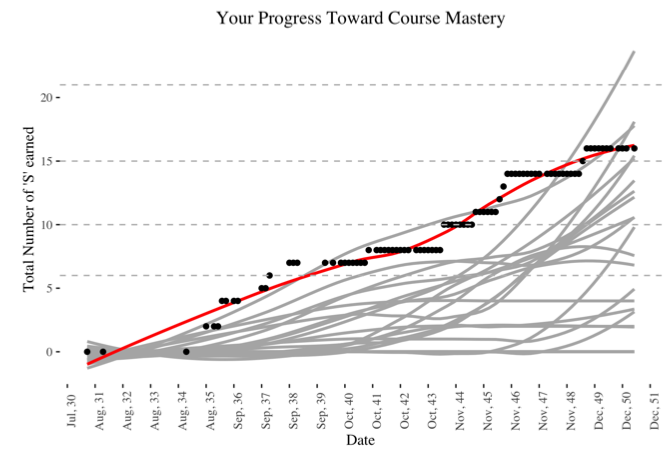

This is a README document for the git repository containing scripts for Jason E. Miller's implementation of mastery grading in his Calculus courses.  Because there are many ways to implement mastery grading, these scripts will certainly need modifications if they are used to support other adaptations of mastery grading.

These scripts do the following:

* use a four-column CSV file to track (1) the date of an assessment (MMDD), (2) a unique identifier for an assessment (two base character with additional 'a', 'b', 'c', etc. to distinguish assessment versions), (3) a unique student identifier like last name, and (4) a symbol representing an evaluation of student work on the assessment.

* using a list of 'learningtargets', the script identifies which learning targets a student has mastered, which a student has not yet mastered, and which as student has not attempted

* the script, usign R markdown, also creates a PDF report of student progress toward course goals, listing ina table earned progress toward learning targets and providing two plots that show a student mastery progress and a students attempts at mastery; both plots put those plots in the context of their classmates' work.

This implementation of mastery grading uses three evaluation categories: satisfactory evidence of mastery (S), insufficient evidence of mastery (I), and no evidence of mastery (N).  A fourth evaluation, excellent evidence of mastery (E), is used but treated like an 'S' in the scripts.  (This is a bug, not a feature.)

## How They Work

The system is set up using three scripts:

1. a CSV file of grade information,
2. a file `grades-master-v1.R` with configuration information for the processing of grades, and
3. a file `grades-engine-v1.R` that processes grad information and produces grade reports.

If you use mastery grading in exactly the way Miller does, you'll not need to modify `grades-engine-v1.R`.  If your adaptation of mastery grades differs, both or all files will need modification.

This README will not address how to make modifications to any file.

## CSV of Grades

The CSV file has a very simple structure.  The first 11 rows of the sample file are shown here.  Note that the first four rows re commented out, and the R command that reads this file is set to recognize that.

```text
% date:  mmdd
% assID: short code representing an action (F1a, tkn)
% lname:  student last name or last name + initial; must be a unique ID
% grade: grade earned on assessment, or token increment
date,assID,lname,grade
1008,L2a,simpson,S
0903,F1a,simpson,I
0915,F2a1,simpson,I
0916,L1a,simpson,S
1023,D1a,simpson,I
```

The command in `grades-master-v1.R` that reads the grades in from this CSV file is

```R
dg <- read_csv("grades-sample.csv",comment="%")
```

Note the argument `comment="%"` tells the script to ignore the first four lines of the grade CSV.

## Configuration Parameters

The file `grades-master-v1.R` contains configuration information for the processing of grades.  The file is reasonably well documented.  Once the first four parameters are set, this file can be `source`d.  I prefer to execute each line individually afdter I've set the parameter value.

The first parameter sets the working directory for the script.  This is the directory that contains your CSV file of grades.  Replace `PATH/TO/WORKING/DIRECTORY` with a the path in the appropriate format for your OS.

```R
# ----------- SET WORKING DIRECTORY -----------
#
# FOR:  setting working directory for script; should contain these scripts
setwd("PATH/TO/WORKING/DIRECTORY")
```

The second parameter sets the output directory for the student reports.  if the directory does not exist, its directory will be created when the script is run.  If files are already in this directory they could be overwritten (e.g., if a new file has the same name as an old file).  Replace `PATH/TO/REPORT/DIRECTORY` with a the path in the appropriate format for your OS.

```R
# ----------- SET OUTPUT DIRECTORY FOR REPORTS -----------
#
# FOR:  create.gradereports function; PATH to directory into which reports should be written
MG_output_dir = "PATH/TO/REPORT/DIRECTORY"
```

A third parameter needs some explaining.

In Miller's implementation of mastery grading, student learning outcomes are granular and are called student learning targets.  Each learning target is assigned a two-character alphanumeric code.  This parameter uses an ordered character vector called `learningtargetorder` to set an order for those learning targets as they appear in the report generated for students.

```R
# ----------- SET LEARNING TARGET ORDER -----------
#
# FOR:  establishing order of LTs in the course
# We want the learning targets listed in order of the syllabus; this vector establishes that order
# NOTE:  this vector must be updated with new learning target IDs
learningtargetorder<-c("F1","F2","F3","L1","L2","L3","L4","L5","D1","D2","D3","D4","D5","D6","D7","A1","A2","A3","A4","A5","I1","I2","I3","I5")
```

The last parameter identifies the name of the CSV files with grades.  The script assumes that this CSV file is in the working directory set above.  In the text below, the file is called `CSV-FILE-NAME.csv`.

```R
# FOR:  loading raw grade data as a data.frame (`dg` represents `d-grade`)
dg <- read_csv("CSV-FILE-NAME.csv",comment="%")
```

## Running the Script

When the above parameters are set, the scripts can be run.  This is where `grades-engine-v1.R` comes to play.  The command below runs this script defines some functions, reads the grade data, and processes the grade data to be ready for reporting.

```R
# ----------- PROCESS DATA -----------
#
source("./grades-engine-v1.R", echo=TRUE)
```

The command below, when executed, will create PDF grade reports for each student represented in the gradebook.  Each report will be saved in the directory specified in the `MG_output_dir` parameter.

```R
create.gradereports(studentlist)
```

Above, the variable `studentlist` is a character vector of all student names (or unique identified) created by `grades-engine-v1.R`.  You can create reports for a subset of students by hand-coding a character vector with the names of the students of interest.

```R
# --- CUSTOM REPORT SETS ---
create.gradereports(c("bob","scratchy"))
```

This README closes with an example of the plot that shows a student's progress toward mastery; the horizontal dashed lines represent cutoffs at the letter grades.

